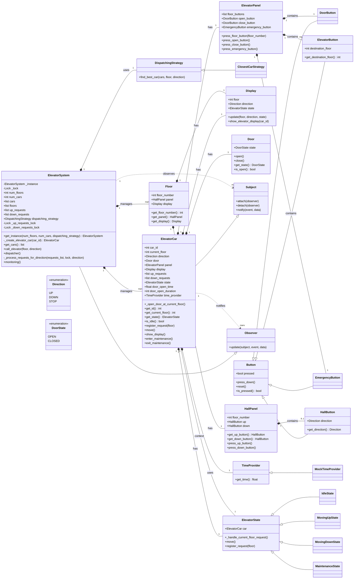

# Elevator System Design

This project implements a simplified elevator system using Python, demonstrating various object-oriented programming principles and design patterns.

## Table of Contents
- [Project Structure](#project-structure)
- [How to Run](#how-to-run)
- [How to Run Tests](#how-to-run-tests)
- [Class Diagram](#class-diagram)
- [Design Principles and Patterns](#design-principles-and-patterns)
- [For Junior Software Engineers (0 to 100 Guide)](#for-junior-software-engineers-0-to-100-guide)
- [Future Enhancements](#future-enhancements)

## Project Structure
```
/design_an_elevator/
├───button.py
├───dispatching_strategy.py
├───display.py
├───door.py
├───elevator_car.py
├───elevator_panel.py
├───elevator_state.py
├───elevator_system.py
├───enums.py
├───floor.py
├───main.py
├───observer.py
├───time_provider.py
├───README.md
└───tests/
    ├───test_button.py
    ├───test_dispatching_strategy.py
    ├───test_display.py
    ├───test_door.py
    ├───test_elevator_car.py
    ├───test_elevator_panel.py
    ├───test_elevator_system.py
    └───test_floor.py
```

## How to Run
To run the elevator simulation, execute the `main.py` file:

```bash
python3 main.py
```

## How to Run Tests
To execute all unit tests for the project, navigate to the root directory of the project and run:

```bash
python3 -m unittest discover tests
```

## Class Diagram
A visual representation of the classes and their relationships.



## Design Principles and Patterns

This project extensively uses Object-Oriented Programming (OOP) principles and several GoF (Gang of Four) design patterns to create a flexible, maintainable, and scalable elevator system.

### Design Principles

1.  **Single Responsibility Principle (SRP):**
    *   **Applied:** Each class generally has one primary reason to change.
        *   `Button` classes (e.g., `DoorButton`, `HallButton`): Responsible only for their pressed state and specific button type behavior.
        *   `Door`: Manages its open/closed state.
        *   `Display`: Manages and shows display information.
        *   `ElevatorCar`: Manages the car's physical movement, internal state, and requests.
        *   `ElevatorPanel`, `HallPanel`: Manage the buttons on their respective panels.
        *   `ElevatorState` subclasses: Each handles the specific behavior of the `ElevatorCar` in a particular state.
        *   `DispatchingStrategy` subclasses: Implement specific logic for finding the best car.
        *   `ElevatorSystem`: Coordinates the overall system, manages cars and requests, and dispatches.
    *   **Benefit:** Reduces coupling, making classes easier to understand, test, and modify independently.

2.  **Open/Closed Principle (OCP):**
    *   **Applied:** Software entities (classes, modules, functions, etc.) should be open for extension, but closed for modification.
        *   **Strategy Pattern:** The `DispatchingStrategy` allows new dispatching algorithms (e.g., `ClosestCarStrategy`) to be added without modifying `ElevatorSystem`.
        *   **State Pattern:** New elevator states (e.g., `MaintenanceState`) can be added by creating a new `ElevatorState` subclass without altering the core `ElevatorCar` logic.
    *   **Benefit:** Promotes extensibility and reduces the risk of introducing bugs when adding new features.

3.  **Liskov Substitution Principle (LSP):**
    *   **Applied:** Subtypes must be substitutable for their base types without altering the correctness of the program.
        *   All `Button` subclasses (`DoorButton`, `HallButton`, `ElevatorButton`, `EmergencyButton`) can be used interchangeably where a `Button` is expected.
        *   All `ElevatorState` subclasses can be assigned to `ElevatorCar.state` and the `ElevatorCar` will behave correctly according to the current state.
        *   `ClosestCarStrategy` can be substituted for `DispatchingStrategy`.
    *   **Benefit:** Ensures that polymorphism works as expected, leading to more robust and flexible code.

4.  **Dependency Inversion Principle (DIP):**
    *   **Applied:** High-level modules should not depend on low-level modules. Both should depend on abstractions. Abstractions should not depend on details. Details should depend on abstractions.
        *   `ElevatorCar` depends on abstract interfaces (`Door`, `ElevatorPanel`, `Display`, `TimeProvider`) rather than concrete implementations. These are injected via the constructor.
        *   `ElevatorSystem` depends on `DispatchingStrategy` (an abstraction) rather than `ClosestCarStrategy` directly.
    *   **Benefit:** Decouples modules, making the system more flexible, testable, and easier to change.

### Design Patterns

1.  **Singleton Pattern:**
    *   **Used in:** `ElevatorSystem`
    *   **How:** Ensures that only one instance of `ElevatorSystem` exists throughout the application and provides a global point of access to it via `ElevatorSystem.get_instance()`.
    *   **Trade-offs:** While it provides a convenient global access point, it can make testing harder due to global state and can hide dependencies. For a system like this where a single central coordinator is logical, it can be acceptable.

2.  **State Pattern:**
    *   **Used in:** `ElevatorCar` and `ElevatorState` hierarchy (`IdleState`, `MovingUpState`, `MovingDownState`, `MaintenanceState`).
    *   **How:** The `ElevatorCar`'s behavior changes based on its internal state. Instead of using large conditional statements, the behavior is encapsulated in separate state objects. The `ElevatorCar` delegates its `move()` and `register_request()` calls to its current `ElevatorState` object.
    *   **Benefit:** Simplifies the `ElevatorCar` class by removing complex conditional logic, makes it easy to add new states, and ensures state-specific behavior is localized.

3.  **Strategy Pattern:**
    *   **Used in:** `ElevatorSystem` and `DispatchingStrategy` hierarchy (`ClosestCarStrategy`).
    *   **How:** Defines a family of algorithms (dispatching strategies), encapsulates each one, and makes them interchangeable. `ElevatorSystem` holds a reference to a `DispatchingStrategy` object and delegates the task of finding the best car to it.
    *   **Benefit:** Allows the dispatching algorithm to be changed independently of the clients that use it, promoting flexibility and extensibility.

4.  **Observer Pattern:**
    *   **Used in:** `Subject` (abstract base class for observable objects), `Observer` (abstract base class for observing objects), `ElevatorCar` (as a `Subject`), and `ElevatorSystem` (as an `Observer`).
    *   **How:** `ElevatorCar` (the Subject) notifies `ElevatorSystem` (the Observer) when a request is fulfilled (e.g., when it reaches a destination floor and opens its doors). This allows `ElevatorSystem` to update its global request queues.
    *   **Benefit:** Establishes a one-to-many dependency between objects so that when one object changes state, all its dependents are notified and updated automatically. This promotes loose coupling.

## Theoretical Concepts

This project leverages several fundamental theoretical concepts in software engineering to build a robust and maintainable system.

### 1. Object-Oriented Programming (OOP)

OOP is a programming paradigm based on the concept of "objects", which can contain data and code that operates on that data. It's designed to increase the reusability and maintainability of software.

*   **Encapsulation:** Bundling data (attributes) and methods that operate on the data within a single unit (class). This hides the internal state of an object from the outside world and only exposes a public interface.
    *   **Application in Code:** Classes like `Door` encapsulate their `state` and provide methods like `open()` and `close()` to interact with it, without exposing the internal representation of the door's state.

*   **Inheritance:** A mechanism where a new class (subclass/derived class) inherits properties and behaviors from an existing class (superclass/base class). This promotes code reuse and establishes a natural hierarchy.
    *   **Application in Code:** `DoorButton`, `HallButton`, `ElevatorButton`, and `EmergencyButton` all inherit from the base `Button` class, sharing common button functionalities while implementing their specific behaviors.

*   **Polymorphism:** The ability of different objects to respond to the same method call in their own way. It allows you to treat objects of different classes in a uniform way through a common interface.
    *   **Application in Code:** All `Button` subclasses implement the `is_pressed()` method. When you call `button.is_pressed()`, the specific implementation for that button type is executed. Similarly, `ElevatorState` subclasses implement `move()` and `register_request()` polymorphically.

*   **Abstraction:** Hiding complex implementation details and showing only the essential features. This is often achieved through abstract classes or interfaces.
    *   **Application in Code:** `Button`, `DispatchingStrategy`, `ElevatorState`, `Subject`, and `Observer` are all abstract classes. They define a contract (what methods must be implemented) without providing the full implementation, allowing different concrete implementations to be swapped in.

### 2. Design Patterns

Design Patterns are reusable solutions to common problems in software design. They are not finished designs that can be directly converted into code, but rather templates that describe how to solve a problem in different situations.

*   **Application in Code:** This project extensively uses several GoF (Gang of Four) design patterns, including Singleton, State, Strategy, and Observer. For a detailed explanation of each and their specific application, please refer to the "Design Principles and Patterns" section above.

### 3. Abstract Base Classes (ABCs)

In Python, ABCs are used to define interfaces. They ensure that derived classes implement certain methods, acting as a blueprint for other classes. The `abc` module provides the infrastructure for defining ABCs.

*   **Application in Code:** `Button`, `DispatchingStrategy`, `ElevatorState`, `Subject`, and `Observer` are all defined as ABCs using `@abstractmethod` decorators, ensuring that any concrete class inheriting from them provides implementations for the abstract methods.

### 4. Enumerations (Enums)

Enums provide a way to define a set of named constant values. They make code more readable, prevent typos, and improve type safety compared to using raw strings or integers.

*   **Application in Code:** The `enums.py` file defines `Direction` (UP, DOWN, STOP) and `DoorState` (OPEN, CLOSED) as enumerations, making the code that uses these states much clearer and less error-prone.

### 5. Concurrency and Threading (and Locks)

Concurrency refers to the ability of different parts of a program to execute independently. Threading is a common way to achieve concurrency within a single process, where multiple threads run seemingly simultaneously.

*   **Shared Resources and Race Conditions:** When multiple threads access and modify shared data, it can lead to unpredictable results (race conditions) if not managed properly.
*   **Locks:** A synchronization primitive used to protect shared resources from concurrent access. A lock ensures that only one thread can access a critical section of code at a time.
    *   **Application in Code:** In `ElevatorSystem`, `threading.Lock` objects (`_up_requests_lock`, `_down_requests_lock`) are used to protect the `up_requests` and `down_requests` lists. Although the current simulation runs in a single thread, these locks demonstrate good practice for potential future expansion into a multi-threaded environment, preventing data corruption if multiple threads were to modify these lists concurrently.

### 6. Unit Testing and Mocking

*   **Unit Testing:** A software testing method where individual units or components of a software are tested. The goal is to validate that each unit of the software performs as designed.
*   **Mocking:** Replacing parts of the system under test with mock objects that simulate the behavior of real objects. This is crucial for isolating the unit being tested from its dependencies.
    *   **Application in Code:** The `tests/` directory contains unit tests for various components. `unittest.mock.Mock` is extensively used to create mock objects (e.g., for `Door`, `ElevatorPanel`, `Display`, `TimeProvider`) to ensure that tests focus only on the logic of the component being tested, without relying on the full functionality of its dependencies.

## For Junior Software Engineers (0 to 100 Guide)

Welcome to the Elevator System project! This guide will help you understand the codebase from the ground up.

### 1. Core Concepts

*   **Object-Oriented Programming (OOP):** This entire system is built using OOP. If you're new to it, focus on understanding:
    *   **Classes and Objects:** Blueprints and instances (e.g., `ElevatorCar` is a class, `car1` is an object).
    *   **Encapsulation:** Bundling data (attributes) and methods that operate on the data within a single unit (class). Notice how `Door` manages its own state and operations.
    *   **Inheritance:** Creating new classes (subclasses) from existing ones (superclasses), inheriting their properties and behaviors (e.g., `DoorButton` inherits from `Button`).
    *   **Polymorphism:** The ability of different objects to respond to the same method call in their own way (e.g., all `Button` types have `is_pressed()`, but their specific behavior might differ).
    *   **Abstraction:** Hiding complex implementation details and showing only the essential features (e.g., `Button` and `ElevatorState` are abstract classes).

*   **Elevator Logic:**
    *   **Requests:** Elevators handle two types of requests:
        *   **Hall Calls:** Made from a `HallPanel` on a floor (e.g., someone on floor 5 wants to go up). These are managed by `ElevatorSystem`.
        *   **Car Calls:** Made from inside an `ElevatorCar` (e.g., someone inside wants to go to floor 7). These are managed by the `ElevatorCar` itself.
    *   **Dispatching:** The `ElevatorSystem` decides which `ElevatorCar` should respond to a hall call using a `DispatchingStrategy`.
    *   **Movement:** Each `ElevatorCar` manages its own movement, stopping at requested floors, opening/closing doors, and changing direction.

### 2. Project Flow - How it All Works Together

1.  **Initialization (`main.py` -> `ElevatorSystem.__init__`):**
    *   `main.py` creates a single instance of `ElevatorSystem` (Singleton pattern).
    *   `ElevatorSystem` creates multiple `ElevatorCar` objects, each with its own `Door`, `ElevatorPanel`, and `Display`.
    *   `ElevatorSystem` also creates `Floor` objects, each with a `HallPanel`.
    *   Crucially, `ElevatorSystem` attaches itself as an `Observer` to each `ElevatorCar`. This means cars will notify the system when they fulfill a request.

2.  **Making a Call (`ElevatorSystem.call_elevator`):**
    *   When a user presses a button on a `HallPanel` (simulated in `main.py` by `system.call_elevator`), the request (floor and direction) is added to `ElevatorSystem`'s global `up_requests` or `down_requests` list.

3.  **Dispatching (`ElevatorSystem.dispatcher`):**
    *   In each time step of the simulation loop (`main.py`), `ElevatorSystem.dispatcher()` is called.
    *   It iterates through the global requests. For each request, it uses its `DispatchingStrategy` (e.g., `ClosestCarStrategy`) to find the "best" `ElevatorCar` to handle that request.
    *   The chosen `ElevatorCar` then `register_request()` internally.

4.  **Car Movement (`ElevatorCar.move` and `ElevatorState`):**
    *   Also in each time step, `ElevatorCar.move()` is called for every car.
    *   The `ElevatorCar` delegates its movement logic to its current `ElevatorState` object (State pattern).
    *   If the car is `Idle`, it might transition to `MovingUpState` or `MovingDownState` if it has requests.
    *   If it's `MovingUpState` or `MovingDownState`, it increments/decrements its `current_floor`.
    *   When a car reaches a requested floor, its `ElevatorState` calls `_open_door_at_current_floor()`.
    *   The `ElevatorCar.move()` method also handles closing the door after a set duration.

5.  **Request Fulfillment Notification (`ElevatorCar.notify` -> `ElevatorSystem.update`):**
    *   When an `ElevatorCar` fulfills a request (reaches a destination and opens its door), its `ElevatorState` calls `self.car.notify("request_fulfilled", ...)`.
    *   Because `ElevatorSystem` is an `Observer` of `ElevatorCar`, its `update()` method is called.
    *   `ElevatorSystem.update()` then removes the fulfilled request from its global `up_requests` or `down_requests` lists.

### 3. Key Files to Understand

*   **`main.py`**: Entry point, sets up the simulation.
*   **`elevator_system.py`**: The central brain. Understand its `__init__`, `call_elevator`, `dispatcher`, and `update` methods.
*   **`elevator_car.py`**: Represents an individual elevator. Focus on `__init__`, `move`, and `register_request`.
*   **`elevator_state.py`**: Crucial for understanding how elevator behavior changes. Read `ElevatorState` and its subclasses (`IdleState`, `MovingUpState`, `MovingDownState`, `MaintenanceState`).
*   **`dispatching_strategy.py`**: See how `ClosestCarStrategy` decides which car to send.
*   **`enums.py`**: Defines important constants like `Direction` and `DoorState`.

### 4. How to Debug and Experiment

*   **Print Statements:** The simplest way to see what's happening. Add `print()` calls in methods like `ElevatorCar.move()`, `ElevatorSystem.dispatcher()`, or within `ElevatorState` methods to trace execution.
*   **Unit Tests:** Look at the `tests/` directory. Each `test_*.py` file shows how a specific component is expected to behave. Running tests (`python3 -m unittest discover tests`) helps you verify changes.
*   **Modify `main.py`:** Change the `num_floors`, `num_cars`, or the `system.call_elevator` requests to experiment with different scenarios.
*   **Change `time_provider.py`:** The `MockTimeProvider` is used in tests. You can see how time is advanced step-by-step.

### 5. Python Specifics

*   **`abc` module (Abstract Base Classes):** Used for defining interfaces (e.g., `Button`, `DispatchingStrategy`, `ElevatorState`, `Subject`, `Observer`). This enforces that subclasses implement certain methods.
*   **`enum` module:** Used for creating readable and type-safe enumerations (e.g., `Direction.UP`).
*   **`threading.Lock`:** Used in `ElevatorSystem` to protect shared resources (`up_requests`, `down_requests`) from concurrent access issues, although in this single-threaded simulation, its primary role is to demonstrate thread-safety principles.
*   **`unittest.mock.Mock`:** Heavily used in tests to simulate the behavior of dependent objects without needing their full implementation. This is vital for isolating components during testing.

## Future Enhancements
*   **Advanced Dispatching Strategies:** Implement other strategies like Zone-based dispatching, or algorithms that minimize wait times or travel times.
*   **Fault Tolerance:** Add mechanisms to handle car failures or maintenance scenarios more robustly.
*   **User Interface:** Develop a graphical user interface (GUI) to visualize elevator movement.
*   **Concurrency:** Implement actual multi-threading or asynchronous programming for more realistic simulation of concurrent car movements and requests.
*   **Persistence:** Save and load elevator system state.
*   **Load Balancing:** Optimize request distribution across multiple cars.
*   **Configuration File:** Externalize system parameters (number of floors, cars, door open duration) into a configuration file.
